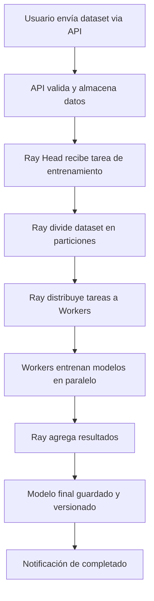
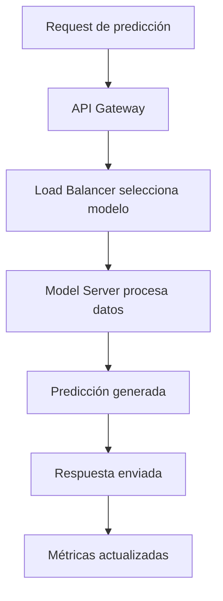
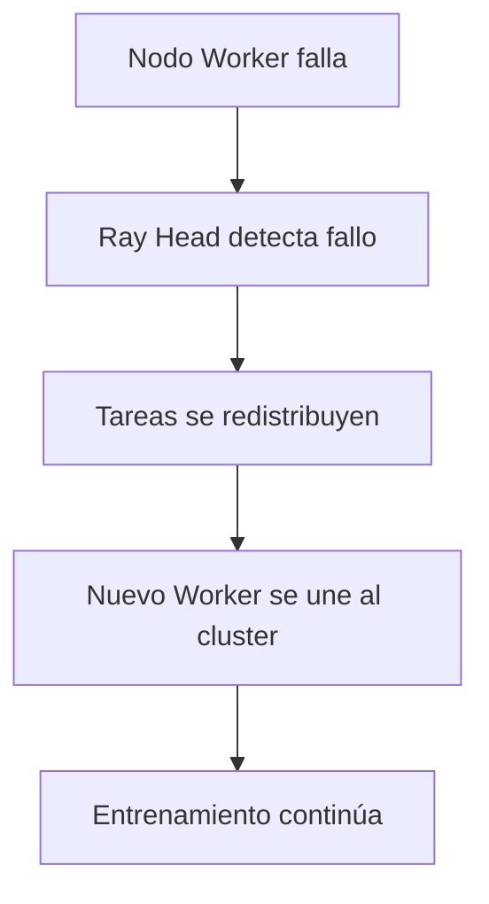

# Arquitectura - Plataforma de Entrenamiento Supervisado Distribuido

## 🏗️ Visión General del Sistema

La plataforma se estructura en **4 capas principales** que trabajan de forma coordinada:

```
┌─────────────────────────────────────────────────────────┐
│                    CAPA DE INTERFAZ                     │
│  [API REST] + [Dashboard Web] + [Monitoreo]            │
└─────────────────────────────────────────────────────────┘
                            │
┌─────────────────────────────────────────────────────────┐
│                CAPA DE ORQUESTACIÓN                    │
│         [Ray Cluster] + [Task Manager]                 │
└─────────────────────────────────────────────────────────┘
                            │
┌─────────────────────────────────────────────────────────┐
│                  CAPA DE PROCESAMIENTO                 │
│  [Training Workers] + [Model Serving] + [Data Pipeline]│
└─────────────────────────────────────────────────────────┘
                            │
┌─────────────────────────────────────────────────────────┐
│               CAPA DE INFRAESTRUCTURA                  │
│    [Docker Containers] + [Storage] + [Network]         │
└─────────────────────────────────────────────────────────┘
```

## 🔧 Componentes Principales

### 1. **Ray Cluster Manager** (Cerebro del Sistema)
**Función:** Coordina todo el trabajo distribuido
- **Ray Head Node:** Nodo líder que coordina tareas
- **Ray Worker Nodes:** Nodos que ejecutan el entrenamiento
- **Ray Dashboard:** Interfaz para monitorear el cluster

**Responsabilidades:**
- Distribuir tareas de entrenamiento entre nodos
- Gestionar recursos (CPU/RAM/GPU)
- Recuperación automática ante fallos
- Balanceo de carga dinámico

### 2. **API Gateway** (Punto de Entrada)
**Función:** Interfaz unificada para interactuar con la plataforma

**Endpoints principales:**
```
POST /api/train          # Iniciar entrenamiento
GET  /api/jobs/{id}      # Estado del entrenamiento  
POST /api/predict        # Hacer predicciones
GET  /api/models         # Listar modelos disponibles
GET  /api/metrics        # Métricas del sistema
```

**Características:**
- Autenticación y autorización
- Rate limiting
- Validación de requests
- Logging centralizado

### 3. **Training Engine** (Motor de Entrenamiento)
**Función:** Ejecuta el entrenamiento distribuido de modelos

**Componentes:**
- **Data Loader:** Carga y preprocesa datasets
- **Model Factory:** Crea instancias de modelos (Scikit-Learn)
- **Training Orchestrator:** Coordina entrenamientos paralelos
- **Model Validator:** Evalúa rendimiento de modelos

**Flujo de trabajo:**
```
Dataset → Preprocessing → Model Creation → Distributed Training → Validation → Storage
```

### 4. **Model Serving** (Servicio de Modelos)
**Función:** Sirve modelos entrenados para inferencia

**Características:**
- Load balancing entre réplicas
- Versionado de modelos
- A/B testing
- Caché de predicciones frecuentes

### 5. **Monitoring & Visualization** (Monitoreo)
**Función:** Observabilidad completa del sistema

**Métricas monitoreadas:**
- **Entrenamiento:** Accuracy, loss, tiempo de convergencia
- **Infraestructura:** CPU, RAM, GPU, red, almacenamiento  
- **API:** Latencia, throughput, errores
- **Modelos:** Deriva de datos, performance en producción

## 🐳 Arquitectura Docker

### Contenedores del Sistema:

```yaml
# docker-compose.yml estructura
services:
  ray-head:          # Nodo coordinador Ray
  ray-worker-1:      # Nodo trabajador Ray #1  
  ray-worker-2:      # Nodo trabajador Ray #2
  ray-worker-n:      # Nodos adicionales (escalable)
  
  api-gateway:       # API REST principal
  model-server:      # Servidor de modelos
  
  monitoring:        # Dashboard de métricas
  database:          # Metadatos y resultados
  storage:           # Almacén de modelos y datos
```

### Red Docker y Autodescubrimiento:
- **Red personalizada:** `ml-platform-network`
- **Service Discovery:** Contenedores se encuentran por nombre
- **Health Checks:** Verificación automática de salud
- **Restart Policies:** Reinicio automático ante fallos

## 🔄 Flujos de Trabajo Principales

### A. Flujo de Entrenamiento Distribuido



### B. Flujo de Inferencia



### C. Flujo de Tolerancia a Fallos



## 🛡️ Tolerancia a Fallos

### Estrategias Implementadas:

1. **Replicación de Ray Head:**
   - Múltiples nodos Head en standby
   - Elección automática de líder
   - Sincronización de estado

2. **Checkpointing:**
   - Guardado periódico del estado de entrenamiento
   - Recuperación desde último checkpoint
   - Almacenamiento distribuido de checkpoints

3. **Health Monitoring:**
   - Heartbeat entre nodos
   - Detección proactiva de fallos
   - Escalado automático de recursos

4. **Data Redundancy:**
   - Réplicas de datasets críticos
   - Backup automático de modelos
   - Versionado de artefactos

## 📊 Monitoreo y Observabilidad

### Dashboard Principal muestra:

**Vista de Cluster:**
- Estado de nodos Ray (activos/inactivos)
- Utilización de recursos por nodo
- Cola de tareas pendientes

**Vista de Entrenamientos:**
- Progreso de entrenamientos activos
- Métricas de rendimiento en tiempo real
- Comparativa entre modelos

**Vista de Producción:**
- Latencia de API endpoints
- Throughput de predicciones
- Errores y alertas

## 🚀 Escalabilidad y Performance

### Escalado Horizontal:
- **Workers dinámicos:** Ray añade/quita workers según demanda
- **Auto-scaling:** Basado en métricas de CPU/memoria
- **Resource quotas:** Límites por usuario/proyecto

### Optimizaciones:
- **Caching:** Resultados de preprocessing y predicciones
- **Batching:** Agrupación de requests para eficiencia
- **Model pruning:** Optimización de modelos para inferencia
- **Compression:** Reducción de tamaño de modelos almacenados

## 🔒 Seguridad

### Medidas de Seguridad:
- **TLS/SSL:** Encriptación de comunicaciones
- **API Keys:** Autenticación de usuarios
- **Network isolation:** Contenedores en redes privadas
- **Resource limits:** Prevención de DoS
- **Audit logging:** Trazabilidad completa

---

Esta arquitectura garantiza un sistema **escalable**, **tolerante a fallos** y **fácil de mantener**, cumpliendo con todos los requisitos del proyecto mientras mantiene la simplicidad operacional.